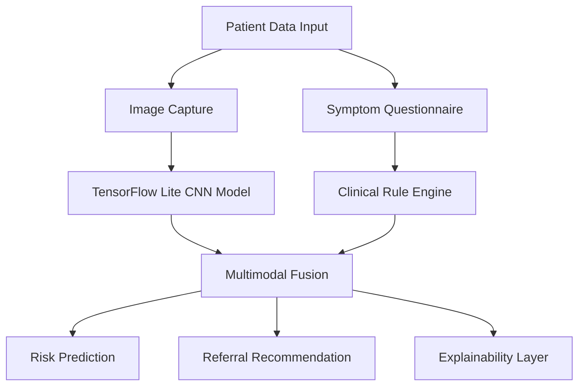

# MedVision India
### Offline Edge-AI Healthcare Screening for Rural India


---

## Overview

**MedVision India** is an offline-first AI-powered healthcare screening platform designed for rural and low-resource environments in India.

The application performs on-device disease screening for:

- Tuberculosis (TB)
- Skin lesions & dermatological conditions
- Ophthalmological diseases such as Diabetic Retinopathy

The system is built specifically for areas with:

- Poor internet connectivity
- Limited specialist access
- High patient-to-doctor ratios
- Delayed diagnosis infrastructure

All AI inference runs **locally on the smartphone** using optimized TensorFlow Lite models, enabling healthcare workers to perform rapid preliminary triage without cloud dependency.

---

# Problem Statement

India continues to face severe healthcare inequality between urban and rural regions.

## Key Challenges

### Rural Specialist Shortage
Community Health Centres (CHCs) in rural India face a massive shortage of:

- Physicians
- Surgeons
- Pediatricians
- Radiologists
- Dermatologists
- Ophthalmologists

Many patients travel over 50–100 km for specialist consultation.

---

### Tuberculosis Burden

India accounts for nearly **25% of global TB cases** according to WHO reports.

Challenges include:

- Delayed diagnosis
- Missed rural screening
- Lack of chest X-ray interpretation access
- Ongoing transmission due to undetected cases

---

### Ophthalmology & Skin Disease Gaps

Millions of diabetic patients in India remain unscreened for:

- Diabetic Retinopathy
- Cataracts
- Vision-threatening lesions

Similarly, dermatological disorders and skin malignancies often remain undiagnosed in rural populations.

---

# Solution

MedVision India provides:

✅ Offline AI inference  
✅ Rapid preliminary triage  
✅ Smartphone-based screening  
✅ Low hardware requirements  
✅ Explainable AI outputs  
✅ Rural healthcare compatibility  

The system combines:

- Image-based deep learning
- Symptom-based clinical logic
- Risk scoring
- Referral prioritization

---

# System Architecture



---

# AI Models Used

| Module | Architecture | Input Type | Goal |
|---|---|---|---|
| TB Screening | MobileNetV3 | Chest X-Ray | TB Detection |
| Dermatology | EfficientNet-Lite | Skin Images | Lesion Classification |
| Ophthalmology | EfficientNet-Lite | Fundus Images | Retinopathy Screening |

---

# Edge AI Optimization

To support low-end Android devices:

- INT8 Quantization
- TensorFlow Lite conversion
- Lightweight CNN architectures
- Reduced memory footprint
- Offline inference pipeline

Target support includes devices with:

- Android 8+
- 2GB RAM
- Entry-level processors

---

# Clinical Workflow

1. Healthcare worker captures patient image
2. Symptoms are entered into the app
3. AI model performs offline analysis
4. Risk score is generated
5. High-risk patients are flagged
6. Referral recommendation is issued

---

# Datasets

## Tuberculosis
- Shenzhen Dataset
- Montgomery Dataset
- Tawsifur Rahman TB Dataset

## Dermatology
- HAM10000
- ISIC Archive

## Ophthalmology
- APTOS 2019
- IDRiD
- ODIR

---

# Privacy & Ethics

## Privacy First Design

- No cloud dependency
- No patient image upload
- No external data transfer
- Local-only processing

## Compliance

The project aims to align with:

- India's DPDP Act 2023
- Ethical AI healthcare principles
- Explainable AI standards

---

# Technology Stack

| Category | Technologies |
|---|---|
| AI Framework | TensorFlow / TensorFlow Lite |
| Language | Python |
| Mobile | Android |
| ML Models | CNN / MobileNet / EfficientNet |
| Image Processing | OpenCV |
| Backend (Optional) | FastAPI / Flask |

---

# Future Goals

- Offline multilingual support
- Voice-assisted healthcare workflow
- Integrated patient reporting
- Federated learning research
- Rural health analytics dashboard
- Edge TPU optimization

---

# Installation

## Clone Repository

```bash
git clone https://github.com/kATHIRVEL101105/MedVisionIndia.git

cd MedVisionIndia
```

---

## Install Dependencies

```bash
pip install -r requirements.txt
```

---

## Run Dataset Pipeline

```bash
cd data/tb

python download_tb_data.py

python preprocess_tb.py
```

---

# Vision

MedVision India aims to reduce diagnostic inequality by enabling frontline healthcare workers with accessible offline AI tools.

The goal is not to replace doctors, but to:

- Improve early detection
- Reduce diagnostic delays
- Optimize specialist workload
- Increase rural healthcare reach

---

# License

Distributed under the MIT License.

See `LICENSE` for more information.

---

# Disclaimer

This application is intended strictly as a **screening and triage support tool** and must not be considered a replacement for professional medical diagnosis.

---

# Author

Developed by **Kathirvel**  
Medical Student • AI Healthcare Enthusiast • Python Developer
