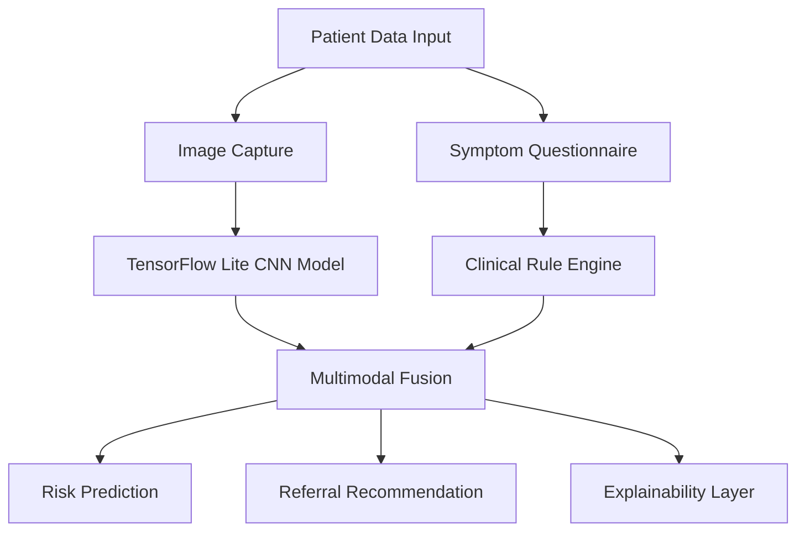

# MedVision India
### Offline Edge-AI Healthcare Screening for Rural India


⭐ If you find this project interesting, consider starring the repository and contributing to development.

---

# Overview

**MedVision India** is an offline-first AI-powered healthcare screening platform designed for rural and low-resource environments in India.

The platform performs on-device disease screening for:

- Tuberculosis (TB)
- Skin lesions & dermatological conditions
- Ophthalmological diseases such as Diabetic Retinopathy

The system is specifically engineered for environments with:

- Poor internet connectivity
- Limited specialist access
- High patient-to-doctor ratios
- Delayed diagnosis infrastructure

All AI inference runs completely **on-device** using optimized TensorFlow Lite models, enabling frontline healthcare workers to perform rapid preliminary triage without cloud dependency.

---

# Demo

> Demo screenshots and prototype videos coming soon.

### Planned Demonstrations

- Offline AI disease screening
- Real-time image analysis
- Explainable AI heatmaps
- Multilingual healthcare workflow
- TensorFlow Lite inference on Android

---

# Problem Statement

India continues to face severe healthcare inequality between urban and rural populations.

## Key Challenges

### Rural Specialist Shortage

Community Health Centres (CHCs) across rural India face major shortages of:

- Physicians
- Surgeons
- Pediatricians
- Radiologists
- Dermatologists
- Ophthalmologists

Many patients travel over 50–100 km for specialist consultation and delayed diagnosis often worsens disease outcomes.

---

### Tuberculosis Burden

India accounts for nearly **25% of global TB cases** according to WHO reports.

Key challenges include:

- Delayed diagnosis
- Missed rural screening
- Limited radiology access
- Lack of trained specialists
- Ongoing transmission from undetected cases

---

### Ophthalmology & Dermatology Gaps

Millions of diabetic patients remain unscreened for:

- Diabetic Retinopathy
- Cataracts
- Vision-threatening retinal disease

Similarly, dermatological conditions and skin malignancies are frequently underdiagnosed in rural populations due to poor specialist accessibility.

---

# Solution

MedVision India provides:

✅ Offline AI inference  
✅ Rapid preliminary triage  
✅ Smartphone-based screening  
✅ Low hardware requirements  
✅ Explainable AI outputs  
✅ Rural healthcare compatibility  
✅ Privacy-first architecture  

The platform combines:

- Image-based deep learning
- Symptom-based clinical logic
- Risk scoring systems
- Referral prioritization
- Edge AI optimization

---

# System Architecture



---

# AI Models Used

| Module | Architecture | Input Type | Goal |
|---|---|---|---|
| TB Screening | MobileNetV3 | Chest X-Ray | TB Detection |
| Dermatology | EfficientNet-Lite | Skin Images | Lesion Classification |
| Ophthalmology | EfficientNet-Lite | Fundus Images | Retinopathy Screening |

---

# Edge AI Optimization

To support low-end Android devices and rural deployment:

- INT8 Quantization
- TensorFlow Lite conversion
- Lightweight CNN architectures
- Reduced memory footprint
- Offline inference pipeline
- Optimized edge deployment

### Target Device Support

- Android 8+
- 2GB RAM devices
- Entry-level processors
- Offline-first usage environments

---

# Clinical Workflow

1. Healthcare worker captures patient image
2. Symptoms are entered into the application
3. AI model performs offline analysis
4. Risk score is generated
5. High-risk patients are flagged
6. Referral recommendation is issued

---

# Datasets

## Tuberculosis
- Shenzhen Dataset
- Montgomery Dataset
- Tawsifur Rahman TB Dataset

## Dermatology
- HAM10000
- ISIC Archive

## Ophthalmology
- APTOS 2019
- IDRiD
- ODIR

---

# Repository Structure

```text
MedVisionIndia/
│
├── data/                  # Dataset pipelines
├── models/                # Trained AI models
├── notebooks/             # Research notebooks
├── app/                   # Android application
├── docs/                  # Documentation
├── tests/                 # Testing scripts
├── requirements.txt
└── README.md
```

---

# Privacy & Ethics

## Privacy-First Design

- No cloud dependency
- No patient image upload
- No external data transfer
- Local-only inference
- Reduced patient data exposure

## Compliance & Responsible AI

This project is being developed with focus on:

- Ethical AI deployment
- Explainable AI systems
- Responsible healthcare AI
- Rural healthcare accessibility
- Privacy-preserving architecture

The platform aims to align with:

- India's DPDP Act 2023
- Responsible AI principles
- Medical data privacy standards

---

# Technology Stack

| Category | Technologies |
|---|---|
| AI Framework | TensorFlow / TensorFlow Lite |
| Language | Python |
| Mobile | Android |
| ML Models | CNN / MobileNet / EfficientNet |
| Image Processing | OpenCV |
| Backend (Optional) | FastAPI / Flask |

---

# Current Development Focus

Current priorities include:

- TB model optimization
- TensorFlow Lite deployment
- Android offline inference
- Dataset balancing
- Explainable AI integration
- Edge-device optimization

---

# Future Goals

- Offline multilingual support
- Voice-assisted healthcare workflow
- Integrated patient reporting
- Federated learning research
- Rural health analytics dashboard
- Edge TPU optimization
- Expanded disease screening support

---

# Research Motivation

This project explores how lightweight edge-AI systems can improve healthcare accessibility in low-resource environments without relying on cloud infrastructure.

The long-term goal is to investigate scalable AI-assisted healthcare delivery models for underserved populations.

---

# Current Limitations

- Models are still under training and validation
- Not clinically certified
- Requires further real-world evaluation
- Limited dataset diversity in current prototype
- Currently designed as a screening aid, not a diagnostic replacement

---

# Installation

## Clone Repository

```bash
git clone https://github.com/kATHIRVEL101105/MedVisionIndia.git

cd MedVisionIndia
```

---

## Install Dependencies

```bash
pip install -r requirements.txt
```

---

## Run Dataset Pipeline

```bash
cd data/tb

python download_tb_data.py

python preprocess_tb.py
```

---

# Mission

MedVision India aims to reduce diagnostic inequality by enabling frontline healthcare workers with accessible offline AI tools.

The objective is not to replace doctors, but to:

- Improve early detection
- Reduce diagnostic delays
- Optimize specialist workload
- Increase rural healthcare reach
- Support scalable healthcare access

---

# Project Progress

| Task | Status |
|---|---|
| README.md | ✅ Completed |
| Dataset Collection | ✅ Completed |
| Model Training | ⏳ In Progress |
| Android App Development | ⏳ In Progress |
| TensorFlow Lite Integration | ⏳ In Progress |
| Offline Inference Pipeline | ⏳ In Progress |
| Explainable AI (Grad-CAM) | ⏳ In Progress |
| Clinical Testing | ⏳ In Progress |

---

# Contributing

MedVision India is actively seeking contributors passionate about:

- Healthcare AI
- Edge AI & TensorFlow Lite
- Android development
- Medical imaging
- Computer Vision
- Public health technology
- Rural healthcare accessibility

We welcome:

- Developers
- Medical students
- Researchers
- AI engineers
- UI/UX designers
- Public health collaborators

---

## Areas Open for Development

- TB screening model optimization
- Dermatology classification pipelines
- Ophthalmology detection systems
- Android application development
- Offline inference optimization
- Explainable AI integration
- Clinical workflow design
- Dataset preprocessing
- Model quantization & deployment

---

## Development Principles

This project is being developed with focus on:

- Privacy-first architecture
- Offline-first accessibility
- Low-resource compatibility
- Ethical AI practices
- Explainable AI systems
- Rural healthcare scalability

The platform aims to align with:

- India's DPDP Act 2023
- Responsible AI principles
- Medical data privacy standards

---

## How to Contribute

1. Fork the repository
2. Create a feature branch
3. Commit your changes
4. Open a Pull Request

Contributions, suggestions, and research collaborations are highly welcome.

---

# License

Distributed under the MIT License.

See `LICENSE` for more information.

---

# Disclaimer

This application is intended strictly as a **screening and triage support tool** and must not be considered a replacement for professional medical diagnosis.

The project is currently under active research and development.

---

# Author

Developed by **Kathirvel**  
Medical Student • AI Healthcare Enthusiast • Python Developer
